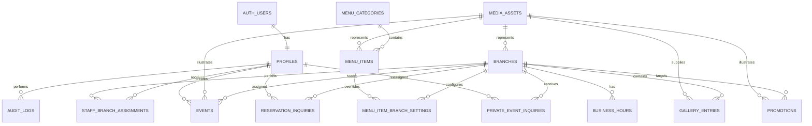

# Gianetto Official Restaurant Website
## Data Model

**Project:** Gianetto Official Restaurant Website  
**Database platform:** Supabase PostgreSQL  
**Authentication:** Supabase Auth  
**Storage:** Supabase Storage  
**Architecture:** Server-first modular monolith  
**Document status:** Approved conceptual data model  
**Last updated:** July 2026  

---

# 1. Document Purpose

This document defines the conceptual and logical data model for the Gianetto Official Restaurant Website.

It establishes:

- database entities;
- table responsibilities;
- field definitions;
- primary and foreign keys;
- relationships;
- publication states;
- branch-specific menu behavior;
- staff roles and branch assignments;
- reservation and private-event inquiry structures;
- live music and event structures;
- media ownership and approval tracking;
- audit-log requirements;
- database constraints;
- indexing guidance;
- deletion and retention behavior;
- migration order.

This document guides the Supabase PostgreSQL implementation.

It is not the final SQL migration file. Exact SQL must be implemented and reviewed through controlled migration tasks.

---

# 2. Data-Modelling Principles

## 2.1 PostgreSQL Is the Source of Truth

Structured operational data belongs in PostgreSQL.

Examples:

- branches;
- operating hours;
- menu items;
- branch availability;
- live music and events;
- reservation inquiries;
- private-event inquiries;
- media metadata;
- promotions;
- staff roles;
- audit logs.

Supabase Storage contains files.

The database contains the metadata and business rules that determine whether those files may be displayed.

---

## 2.2 Use UUID Primary Keys

Primary business entities should use PostgreSQL UUID values.

Example:

```sql
id uuid primary key default gen_random_uuid()
```

Reasons:

- difficult to guess;
- safe for distributed creation;
- compatible with Supabase Auth;
- suitable for public and internal references;
- avoids sequential-record exposure.

Customer-facing inquiry reference numbers remain separate from database IDs.

---

## 2.3 Use UTC for Timestamps

All timestamp fields should use:

```sql
timestamptz
```

PostgreSQL stores the value consistently, while the application displays dates using the appropriate business timezone.

Gianetto’s working timezone is:

```text
Asia/Manila
```

Local operating hours may use PostgreSQL `time` values because they represent repeating local business times rather than absolute moments.

---

## 2.4 Use Philippine Peso for MVP Pricing

Menu prices will initially use:

```text
PHP
```

Money values should use:

```sql
numeric(10,2)
```

Do not use floating-point types for currency.

A currency field may default to `PHP` to preserve future flexibility.

---

## 2.5 Separate Published Content from Draft Content

A record existing in the database does not automatically mean it may appear publicly.

Public queries must require the appropriate state, such as:

```text
is_active = true
is_published = true
status = PUBLISHED
approved_for_web = true
```

The required field depends on the entity.

---

## 2.6 Avoid Universal Soft Deletion

The system will not automatically add `deleted_at` to every table.

Instead:

- branches use `is_active`;
- menu items use `is_published`;
- events use lifecycle statuses;
- promotions use lifecycle statuses;
- staff profiles use `is_active`;
- inquiries use status and optional archival timestamps.

Hard deletion should be restricted for records with business history or active relationships.

---

## 2.7 Preserve Historical Business Records

The application should not delete a branch merely because it closes.

Instead:

```text
branches.is_active = false
```

Similarly, completed events and handled inquiries may remain in the database according to the approved retention policy.

---

## 2.8 Do Not Duplicate Authentication Secrets

Passwords, authentication tokens, and password-recovery information belong to Supabase Auth.

The application database must not store:

- passwords;
- password hashes;
- refresh tokens;
- provider tokens;
- secret authentication metadata.

The `profiles` table stores only restaurant-specific staff information.

---

## 2.9 Store Only Necessary Customer Data

Reservation and private-event inquiries should collect only the information required for restaurant follow-up.

The system should not build customer profiles or behavioral tracking records during the MVP.

---

# 3. Naming Conventions

## 3.1 Tables

Use plural snake_case names.

Examples:

```text
branches
menu_items
reservation_inquiries
staff_branch_assignments
```

## 3.2 Columns

Use snake_case names.

Examples:

```text
created_at
branch_id
is_published
requested_date
```

## 3.3 Foreign Keys

Foreign-key columns should use:

```text
<referenced_entity>_id
```

Examples:

```text
branch_id
menu_item_id
media_asset_id
actor_profile_id
```

## 3.4 Boolean Fields

Boolean fields should communicate a clear true-or-false condition.

Examples:

```text
is_active
is_available
is_featured
is_published
approved_for_web
reservation_required
```

## 3.5 Timestamp Fields

Standard lifecycle timestamps:

```text
created_at
updated_at
published_at
approved_at
cancelled_at
archived_at
```

---

# 4. High-Level Entity Relationship Model



---

# 5. Core Tables

The proposed core tables are:

```text
profiles
staff_branch_assignments

branches
business_hours

menu_categories
menu_items
menu_item_branch_settings

events

reservation_inquiries
private_event_inquiries

media_assets
gallery_entries
promotions

audit_logs
```

The following table remains optional for the initial release:

```text
site_content
```

Marketing copy may remain version-controlled until Gianetto requires staff-editable page content.

---

# 6. Profiles

## 6.1 Purpose

The `profiles` table extends Supabase Auth users with Gianetto-specific staff data.

Supabase Auth confirms identity.

The profile determines the person’s restaurant role and active status.

## 6.2 Relationship

```text
auth.users.id
      ↓ one-to-one
profiles.id
```

## 6.3 Proposed Fields

```text
profiles
- id
- full_name
- role
- is_active
- job_title
- created_at
- updated_at
```

## 6.4 Field Definitions

### `id`

```sql
uuid primary key
references auth.users(id)
```

The profile ID must match the authenticated user ID.

### `full_name`

Staff member’s display name.

```sql
text not null
```

### `role`

One of:

```text
OWNER
ADMIN
CONTENT_MANAGER
BRANCH_MANAGER
```

### `is_active`

Controls whether the staff member may use the administration portal.

```sql
boolean not null default true
```

An authenticated account with an inactive profile must be denied application access.

### `job_title`

Optional business-facing title.

Examples:

```text
Owner
Restaurant Manager
Marketing Coordinator
Branch Supervisor
```

This field does not grant permissions.

### `created_at`

Profile creation timestamp.

### `updated_at`

Profile modification timestamp.

## 6.5 Constraints

- `id` must exist in `auth.users`;
- `role` must use an approved value;
- `full_name` must not be empty;
- inactive users must not perform protected operations.

## 6.6 Deletion Behavior

Staff should normally be deactivated rather than deleted.

```text
is_active = false
```

Deleting the Supabase Auth user should be an owner-controlled exceptional operation.

---

# 7. Staff Branch Assignments

## 7.1 Purpose

The `staff_branch_assignments` table identifies which branches a staff member may manage.

It is especially important for Branch Managers.

## 7.2 Proposed Fields

```text
staff_branch_assignments
- profile_id
- branch_id
- created_at
- created_by
```

## 7.3 Primary Key

Use a composite key:

```sql
primary key (profile_id, branch_id)
```

This prevents duplicate assignments.

## 7.4 Relationships

```text
profiles
    ↓
staff_branch_assignments
    ↓
branches
```

## 7.5 Authorization Meaning

An assignment does not grant unrestricted access by itself.

Permission must consider:

```text
authenticated profile
+
active profile
+
staff role
+
branch assignment
+
requested operation
```

## 7.6 Deletion Behavior

Assignments may be deleted when access is revoked.

Deleting an assignment must not delete the staff profile or branch.

---

# 8. Branches

## 8.1 Purpose

The `branches` table stores public and administrative information for each Gianetto location.

## 8.2 Proposed Fields

```text
branches
- id
- name
- short_name
- slug
- description
- full_address
- city
- region
- postal_code
- map_url
- mobile_number
- landline
- public_email
- parking_information
- accessibility_information
- reservation_instructions
- private_event_information
- hero_media_id
- is_active
- display_order
- created_at
- updated_at
```

## 8.3 Field Definitions

### `name`

Official branch name.

Example:

```text
Gianetto Parqal
```

### `short_name`

Customer-facing short label.

Example:

```text
Parqal
```

### `slug`

URL-safe identifier.

Examples:

```text
parqal
capitol-commons
```

Requirements:

- lowercase;
- unique;
- hyphen-separated;
- stable after publication when possible.

### `description`

Optional branch-specific introduction.

### `full_address`

Owner-approved public address.

### `city`

Examples:

```text
Parañaque City
Pasig City
```

### `region`

Working value:

```text
Metro Manila
```

### `postal_code`

Optional until verified.

### `map_url`

Approved Google Maps or other map destination.

### `mobile_number`

Primary public mobile contact.

### `landline`

Optional public landline.

### `public_email`

Optional branch-specific public email.

### `parking_information`

Customer-facing parking or access guidance.

### `accessibility_information`

Verified accessibility information only.

Do not claim accessibility features that have not been confirmed.

### `reservation_instructions`

Branch-specific reservation guidance.

### `private_event_information`

Branch-specific private-event summary.

### `hero_media_id`

Optional reference to an approved media asset.

### `is_active`

Controls whether the branch appears publicly.

### `display_order`

Controls branch ordering on public and admin pages.

## 8.4 Constraints

- `slug` must be unique;
- `name` must not be empty;
- `display_order` should be zero or greater;
- an inactive branch must not appear in standard public listings.

## 8.5 Deletion Behavior

Branches should not normally be deleted.

Use:

```text
is_active = false
```

Hard deletion should be blocked when the branch has:

- inquiries;
- events;
- menu settings;
- gallery entries;
- audit history.

---

# 9. Business Hours

## 9.1 Purpose

The `business_hours` table stores repeating weekly operating hours per branch.

## 9.2 Proposed Fields

```text
business_hours
- id
- branch_id
- day_of_week
- period_index
- opens_at
- closes_at
- is_closed
- note
- created_at
- updated_at
```

## 9.3 Day Numbering

Use ISO-style numbering:

```text
1 = Monday
2 = Tuesday
3 = Wednesday
4 = Thursday
5 = Friday
6 = Saturday
7 = Sunday
```

## 9.4 Multiple Periods

`period_index` supports split schedules.

Example:

```text
Monday
Period 1: 10:00–14:00
Period 2: 17:00–22:00
```

Most Gianetto days may use only one period.

## 9.5 Closed Day

When `is_closed = true`:

- `opens_at` should be null;
- `closes_at` should be null.

## 9.6 Constraints

```text
day_of_week between 1 and 7
period_index >= 1
```

For open periods:

```text
opens_at is not null
closes_at is not null
closes_at > opens_at
```

Unique combination:

```sql
unique (branch_id, day_of_week, period_index)
```

## 9.7 Holiday Exceptions

Special holiday hours and temporary closures are not part of the first schema.

A future table may be introduced:

```text
branch_schedule_exceptions
```

This should be added only when Gianetto confirms the operational need.

---

# 10. Menu Categories

## 10.1 Purpose

The `menu_categories` table organizes public menu items.

## 10.2 Proposed Fields

```text
menu_categories
- id
- name
- slug
- description
- display_order
- is_active
- created_at
- updated_at
```

## 10.3 Examples

Possible categories include:

```text
Appetizers
Salads
Soups
Stews
Mains
Risotto
Ravioli
Pasta
Pizza
Desserts
Gelato
Drinks
```

The final categories must come from the verified current menu.

## 10.4 Constraints

- `name` must not be empty;
- `slug` must be unique;
- `display_order` must be zero or greater;
- inactive categories must not appear publicly;
- inactive categories must not automatically delete their menu items.

---

# 11. Menu Items

## 11.1 Purpose

The `menu_items` table stores the shared definition of a dish or drink.

Branch-specific availability and overrides belong in `menu_item_branch_settings`.

## 11.2 Proposed Fields

```text
menu_items
- id
- category_id
- name
- slug
- description
- default_price
- currency_code
- image_media_id
- dietary_labels
- allergen_note
- is_featured
- is_published
- published_at
- display_order
- created_at
- updated_at
```

## 11.3 Field Definitions

### `category_id`

References `menu_categories`.

### `name`

Current owner-approved menu item name.

### `slug`

Unique URL-safe identifier.

Individual menu-item pages are not required for the MVP, but stable slugs remain useful for links and future features.

### `description`

Owner-approved menu description.

Do not copy descriptions from third-party articles without permission.

### `default_price`

Default menu price.

```sql
numeric(10,2)
```

May be null only when the business uses another verified pricing presentation, such as market price.

### `currency_code`

```text
PHP
```

Default:

```sql
'PHP'
```

### `image_media_id`

Optional approved media asset.

### `dietary_labels`

A small controlled set of labels.

Possible values may include:

```text
VEGETARIAN
SPICY
SEAFOOD
```

Labels must not be presented as medically reliable allergen guarantees.

### `allergen_note`

Optional owner-verified information.

Do not add allergen claims unless Gianetto can maintain their accuracy.

### `is_featured`

Indicates possible homepage or featured-menu use.

### `is_published`

Controls public visibility.

### `published_at`

Timestamp of first or most recent publication.

### `display_order`

Controls ordering within the category.

## 11.4 Constraints

- `name` must not be empty;
- `slug` must be unique;
- `default_price` must be zero or greater when present;
- `display_order` must be zero or greater;
- a menu item should not be publicly shown when its category is inactive.

## 11.5 Price Variants

Some restaurant items may have multiple sizes or serving options.

Examples:

```text
Regular
Large
Solo
Sharing
Glass
Bottle
```

If the verified current menu requires multiple prices per item, introduce:

```text
menu_item_variants
- id
- menu_item_id
- name
- price
- display_order
- is_active
```

Do not add this table before reviewing the current menu.

---

# 12. Menu Item Branch Settings

## 12.1 Purpose

The `menu_item_branch_settings` table controls how a shared menu item behaves at a specific branch.

## 12.2 Proposed Fields

```text
menu_item_branch_settings
- id
- menu_item_id
- branch_id
- price_override
- is_available
- is_featured
- display_order
- created_at
- updated_at
```

## 12.3 Relationship

```text
menu_items
      ↓
menu_item_branch_settings
      ↓
branches
```

## 12.4 Behavior

### No Branch Setting Exists

The application may use the menu item’s default values.

### Branch Setting Exists

The branch setting may override:

- availability;
- price;
- featured state;
- display order.

### Price Calculation

```text
Effective price =
price_override when present
otherwise default_price
```

## 12.5 Constraints

Unique relationship:

```sql
unique (menu_item_id, branch_id)
```

Additional rules:

- `price_override` must be zero or greater;
- inactive branches must not expose menu settings publicly;
- unpublished menu items remain private even when branch settings exist.

## 12.6 Deletion Behavior

Deleting a menu item may delete its branch-setting rows only after authorization and dependency review.

Deleting a branch should not normally occur.

---

# 13. Events

## 13.1 Purpose

The `events` table stores branch-specific live music and restaurant events.

## 13.2 Proposed Fields

```text
events
- id
- branch_id
- title
- slug
- event_type
- performer_name
- summary
- description
- starts_at
- ends_at
- poster_media_id
- reservation_required
- reservation_note
- status
- is_featured
- published_at
- cancelled_at
- cancellation_note
- created_by
- updated_by
- created_at
- updated_at
```

## 13.3 Event Types

Initial values:

```text
LIVE_MUSIC
ACOUSTIC_PERFORMANCE
SPECIAL_DINNER
HOLIDAY_EVENT
BRANCH_EVENT
PROMOTIONAL_EVENT
OTHER
```

## 13.4 Event Statuses

```text
DRAFT
PUBLISHED
CANCELLED
COMPLETED
```

## 13.5 Date and Time Design

Use:

```sql
starts_at timestamptz not null
ends_at timestamptz null
```

This is preferred over separate event-date and time fields because it:

- avoids date-time ambiguity;
- supports accurate sorting;
- simplifies upcoming-event queries;
- preserves timezone-aware values;
- supports events crossing midnight if ever necessary.

Display values should use:

```text
Asia/Manila
```

## 13.6 Performer Name

`performer_name` is optional because some events may not involve a named performer.

The performer name must be approved for public use.

## 13.7 Poster

`poster_media_id` may reference only an approved media asset.

The event may still be published without a poster when Gianetto approves a text-only presentation.

## 13.8 Reservation Requirement

```text
reservation_required = true
```

means customers should receive clear booking instructions.

This does not mean the website contains a live ticketing or seat-allocation system.

## 13.9 Featured Events

`is_featured = true` allows the event to appear prominently on:

- the homepage;
- branch pages;
- event highlights.

Featured status does not override publication status.

## 13.10 Constraints

- `slug` must be unique;
- `branch_id` is required;
- `starts_at` is required;
- `ends_at` must be later than `starts_at` when present;
- `PUBLISHED` events should have `published_at`;
- `CANCELLED` events should have `cancelled_at`;
- draft events must not appear publicly.

## 13.11 Upcoming Event Rule

An upcoming public event generally requires:

```text
status = PUBLISHED
starts_at >= current time
branch.is_active = true
```

## 13.12 Completed Event Behavior

A past event should not appear in the upcoming-event list.

The application may classify it as completed when:

```text
ends_at < current time
```

or, when no end time exists:

```text
starts_at < an approved completion threshold
```

The final archival behavior will be implemented in the event service.

## 13.13 Recurring Events

Recurring schedules are deferred.

Each MVP event should be stored as an individual event record.

---

# 14. Reservation Inquiries

## 14.1 Purpose

The `reservation_inquiries` table stores customer requests for table reservations.

A record is an inquiry, not a confirmed booking.

## 14.2 Proposed Fields

```text
reservation_inquiries
- id
- reference_number
- branch_id
- customer_name
- email
- mobile_number
- requested_date
- requested_time
- guest_count
- special_request
- status
- assigned_to
- staff_note
- privacy_consent_at
- privacy_policy_version
- archived_at
- created_at
- updated_at
```

## 14.3 Reference Number

`reference_number` is a customer-facing identifier.

Example format:

```text
GIA-RES-20260718-A7K2
```

Requirements:

- unique;
- generated server-side;
- not based solely on a sequential number;
- not treated as an authentication secret.

## 14.4 Contact Information

Recommended MVP requirement:

- `mobile_number` required;
- `email` optional.

This should be confirmed with Gianetto.

At least one usable contact method must exist.

## 14.5 Requested Date and Time

Use:

```sql
requested_date date
requested_time time
```

These fields represent the customer’s preferred local branch schedule.

They do not represent a confirmed booking time.

## 14.6 Guest Count

```sql
smallint
```

Database constraint:

```text
guest_count > 0
```

The application may enforce a smaller online maximum after owner confirmation.

Larger groups may be redirected to the private-event inquiry.

## 14.7 Reservation Statuses

```text
NEW
CONTACTED
CONFIRMED
DECLINED
CANCELLED
COMPLETED
```

## 14.8 Assigned Staff

`assigned_to` optionally references a staff profile.

Assignment does not replace branch authorization.

## 14.9 Staff Note

Internal staff note.

It must never appear on the public website.

Sensitive customer information should not be repeated unnecessarily in staff notes.

## 14.10 Privacy Consent

The system should record:

```text
privacy_consent_at
privacy_policy_version
```

This indicates which published notice the customer accepted.

## 14.11 Archival

`archived_at` allows handled inquiries to leave the default active admin view without deleting them.

## 14.12 Constraints

- `reference_number` must be unique;
- `branch_id` is required;
- `customer_name` is required;
- `mobile_number` or another approved contact method is required;
- `requested_date` is required;
- `requested_time` is required;
- `guest_count` must be greater than zero;
- `privacy_consent_at` is required.

## 14.13 Public Access

Anonymous visitors may submit through a secured Next.js server operation.

Anonymous visitors may not:

- query inquiry records;
- retrieve another customer’s inquiry;
- update inquiry status;
- read staff notes.

---

# 15. Private-Event Inquiries

## 15.1 Purpose

The `private_event_inquiries` table stores customer requests for celebrations, corporate gatherings, and private dining arrangements.

## 15.2 Proposed Fields

```text
private_event_inquiries
- id
- reference_number
- branch_id
- customer_name
- organization_name
- email
- mobile_number
- preferred_date
- preferred_time
- estimated_guest_count
- event_type
- event_requirements
- budget_range
- status
- assigned_to
- staff_note
- privacy_consent_at
- privacy_policy_version
- archived_at
- created_at
- updated_at
```

## 15.3 Event Types

Initial inquiry values:

```text
BIRTHDAY
FAMILY_CELEBRATION
CORPORATE_DINNER
REUNION
WEDDING_RELATED
PRODUCT_LAUNCH
PRIVATE_DINING
HOLIDAY_GATHERING
OTHER
```

These are inquiry categories and are separate from the public `events.event_type`.

## 15.4 Reference Number

Example:

```text
GIA-EVT-20260718-P4D8
```

## 15.5 Organization Name

Optional.

Useful for:

- companies;
- organizations;
- schools;
- formal groups.

## 15.6 Guest Count

Must be greater than zero.

No fixed maximum should be added until branch capacities are verified.

## 15.7 Budget Range

Optional text field during the MVP.

Do not require customers to disclose a budget unless Gianetto confirms it is operationally necessary.

## 15.8 Statuses

```text
NEW
CONTACTED
QUALIFIED
PROPOSAL_SENT
CONFIRMED
DECLINED
CANCELLED
COMPLETED
```

The final list may be simplified after owner review.

## 15.9 Public Access

The same privacy restrictions as reservation inquiries apply.

---

# 16. Media Assets

## 16.1 Purpose

The `media_assets` table stores metadata for files held in Supabase Storage.

A Storage object alone does not authorize public use.

## 16.2 Proposed Fields

```text
media_assets
- id
- storage_bucket
- storage_path
- original_file_name
- mime_type
- size_bytes
- width
- height
- title
- alt_text
- media_type
- source_type
- ownership_status
- photographer_credit
- rights_note
- branch_id
- approved_for_web
- approved_by
- approved_at
- uploaded_by
- created_at
- updated_at
```

## 16.3 Media Types

```text
IMAGE
DOCUMENT
VIDEO
```

The MVP should primarily support images.

Video uploads may be deferred because of file size and delivery requirements.

## 16.4 Source Types

Possible values:

```text
BUSINESS_UPLOAD
STAFF_PHOTOGRAPH
COMMISSIONED_PHOTOGRAPHY
CUSTOMER_SUBMISSION
PERFORMER_MATERIAL
LICENSED_ASSET
AI_GENERATED
LEGACY_IMPORT
OTHER
```

## 16.5 Ownership Statuses

```text
BUSINESS_OWNED
COMMISSIONED
LICENSED
CUSTOMER_PERMISSION
PERFORMER_PERMISSION
AI_GENERATED_PLACEHOLDER
UNVERIFIED
RESTRICTED
```

## 16.6 Public Eligibility

A media asset may appear publicly only when:

```text
Storage object exists
AND
approved_for_web = true
AND
ownership_status is acceptable
```

`UNVERIFIED` and `RESTRICTED` assets must not appear publicly.

## 16.7 Alt Text

Publicly displayed content images should have meaningful alternative text.

Decorative images may use empty alternative text at the component level when appropriate.

## 16.8 Photographer Credit

Required when the license or agreement requires attribution.

## 16.9 Rights Note

Internal explanation of:

- source;
- permission;
- restrictions;
- approved platforms;
- expiration date, if applicable.

## 16.10 Branch Relationship

`branch_id` is optional.

It may identify the primary branch shown in the media.

This does not prevent the asset from being reused elsewhere when permitted.

## 16.11 Constraints

- `storage_bucket` and `storage_path` must identify a unique object;
- file size must be zero or greater;
- width and height must be positive when present;
- `approved_by` and `approved_at` should exist when `approved_for_web = true`;
- unverified assets must not be publicly approved.

## 16.12 Deletion Behavior

A media asset should not be deleted while referenced by:

- a branch;
- a menu item;
- an event;
- a gallery entry;
- a promotion.

The admin interface should first identify and remove those references.

---

# 17. Gallery Entries

## 17.1 Purpose

The `gallery_entries` table determines which approved media assets appear in the public gallery.

## 17.2 Proposed Fields

```text
gallery_entries
- id
- media_asset_id
- branch_id
- title
- caption
- display_order
- is_published
- published_at
- created_at
- updated_at
```

## 17.3 Relationship

```text
media_assets
      ↓
gallery_entries
```

The gallery entry does not duplicate the file.

## 17.4 Branch Assignment

`branch_id` is optional.

A null branch may represent:

- general brand content;
- cross-branch content;
- non-location-specific food photography.

## 17.5 Public Rule

A gallery entry may appear publicly only when:

```text
gallery_entries.is_published = true
AND
media_assets.approved_for_web = true
```

## 17.6 Constraints

- `media_asset_id` is required;
- `display_order` must be zero or greater;
- an unapproved media asset cannot be published through a gallery entry.

---

# 18. Promotions

## 18.1 Purpose

The `promotions` table stores temporary restaurant offers and promotional campaigns.

Promotions remain distinct from scheduled events.

## 18.2 Proposed Fields

```text
promotions
- id
- branch_id
- title
- slug
- summary
- description
- terms
- starts_at
- ends_at
- media_asset_id
- status
- is_featured
- published_at
- created_by
- updated_by
- created_at
- updated_at
```

## 18.3 Branch Assignment

`branch_id` may be null for a business-wide promotion.

## 18.4 Promotion Statuses

```text
DRAFT
PUBLISHED
ARCHIVED
CANCELLED
```

## 18.5 Date Rules

- `starts_at` may be null for an immediately active promotion;
- `ends_at` may be null for an open-ended promotion;
- when both exist, `ends_at` must be later than `starts_at`.

## 18.6 Public Rule

A promotion may appear when:

```text
status = PUBLISHED
AND
current time is within the approved date range
AND
assigned branch is active, when branch-specific
```

## 18.7 Terms

Promotional limitations and conditions should be stored in `terms`.

Only owner-approved promotion details may be published.

---

# 19. Audit Logs

## 19.1 Purpose

The `audit_logs` table records significant administrative actions.

It provides accountability and operational traceability.

It is not a complete event-sourcing system.

## 19.2 Proposed Fields

```text
audit_logs
- id
- actor_profile_id
- action
- entity_type
- entity_id
- branch_id
- summary
- metadata
- created_at
```

## 19.3 Example Actions

```text
MENU_CATEGORY_CREATED
MENU_ITEM_CREATED
MENU_ITEM_UPDATED
MENU_ITEM_PUBLISHED
MENU_PRICE_CHANGED
MENU_AVAILABILITY_CHANGED

BRANCH_UPDATED
BUSINESS_HOURS_UPDATED
BRANCH_DEACTIVATED

EVENT_CREATED
EVENT_UPDATED
EVENT_PUBLISHED
EVENT_CANCELLED

RESERVATION_STATUS_CHANGED
PRIVATE_EVENT_STATUS_CHANGED

MEDIA_UPLOADED
MEDIA_APPROVED
MEDIA_UNPUBLISHED

PROMOTION_PUBLISHED
PROMOTION_CANCELLED

STAFF_ROLE_CHANGED
STAFF_BRANCH_ASSIGNED
STAFF_DEACTIVATED
```

## 19.4 Entity Types

Possible values:

```text
PROFILE
BRANCH
BUSINESS_HOURS
MENU_CATEGORY
MENU_ITEM
MENU_BRANCH_SETTING
EVENT
RESERVATION_INQUIRY
PRIVATE_EVENT_INQUIRY
MEDIA_ASSET
GALLERY_ENTRY
PROMOTION
```

## 19.5 Metadata

Use PostgreSQL `jsonb`.

Metadata may contain limited structured information such as:

```json
{
  "previous_status": "DRAFT",
  "new_status": "PUBLISHED"
}
```

Do not copy complete customer inquiries into audit metadata.

## 19.6 Immutability

Audit logs should be append-only.

Normal staff users must not:

- update audit records;
- delete audit records;
- rewrite actor information.

---

# 20. Optional Site Content Table

## 20.1 Status

Deferred unless Gianetto needs staff-editable marketing copy.

## 20.2 Purpose

A future `site_content` table may hold controlled public content blocks.

Examples:

```text
homepage_introduction
our_story
private_events_introduction
footer_notice
```

## 20.3 Proposed Fields

```text
site_content
- id
- content_key
- title
- body
- metadata
- is_published
- published_at
- updated_by
- created_at
- updated_at
```

## 20.4 Constraint

`content_key` must be unique.

## 20.5 Scope Rule

Do not create a generic page builder or unrestricted JSON CMS during the MVP.

Marketing copy may remain in source control until owner editing becomes necessary.

---

# 21. Relationship Summary

## 21.1 Staff and Branches

```text
profiles
    ↓ many-to-many
staff_branch_assignments
    ↓
branches
```

## 21.2 Branch and Hours

```text
branches
    ↓ one-to-many
business_hours
```

## 21.3 Menu Structure

```text
menu_categories
    ↓ one-to-many
menu_items
    ↓ one-to-many
menu_item_branch_settings
    ↓ many-to-one
branches
```

## 21.4 Branch Events

```text
branches
    ↓ one-to-many
events
```

## 21.5 Inquiries

```text
branches
    ├── reservation_inquiries
    └── private_event_inquiries
```

## 21.6 Media

```text
media_assets
    ├── branches.hero_media_id
    ├── menu_items.image_media_id
    ├── events.poster_media_id
    ├── gallery_entries.media_asset_id
    └── promotions.media_asset_id
```

---

# 22. Delete and Foreign-Key Rules

## 22.1 Recommended `ON DELETE RESTRICT`

Use for important business relationships such as:

```text
branches referenced by inquiries
branches referenced by events
menu categories referenced by menu items
media assets referenced by public content
profiles referenced by audit logs
```

This prevents accidental loss of history.

## 22.2 Recommended `ON DELETE CASCADE`

Use only where the child record has no independent business meaning.

Examples:

```text
staff_branch_assignments when a profile is deleted
menu_item_branch_settings when a menu item is deleted
```

Even when cascading is technically allowed, the application must confirm destructive actions.

## 22.3 Recommended `ON DELETE SET NULL`

May be appropriate for:

```text
assigned_to on inquiries
created_by or updated_by on historical content
branch_id on media assets
```

This preserves the business record if a staff profile is removed.

---

# 23. Status and Controlled-Value Strategy

The first implementation should use either:

- PostgreSQL enum types; or
- text columns with database `CHECK` constraints.

## Recommended MVP Direction

Use text columns with `CHECK` constraints.

Advantages:

- easier to revise during early business verification;
- simpler migrations when a new status is added;
- readable database values;
- compatible with generated TypeScript types.

Example:

```sql
status text not null
check (
  status in (
    'DRAFT',
    'PUBLISHED',
    'CANCELLED',
    'COMPLETED'
  )
)
```

Do not rely only on TypeScript unions.

The database must reject invalid status values.

---

# 24. Shared Timestamp Behavior

Tables with mutable records should normally contain:

```text
created_at
updated_at
```

Recommended defaults:

```sql
created_at timestamptz not null default now()
updated_at timestamptz not null default now()
```

Create a reusable database trigger function to set `updated_at` automatically.

Example conceptual function:

```sql
set_updated_at()
```

Apply it only to tables with an `updated_at` field.

Audit logs should not require `updated_at` because they are immutable.

---

# 25. Slug Rules

Slugs should be:

- lowercase;
- URL-safe;
- unique within the relevant table;
- created from verified titles or names;
- manually reviewable;
- stable after publication.

Examples:

```text
parqal
capitol-commons
truffle-mushroom-pasta
friday-live-acoustic-night
```

Changing a published slug may break links.

Future implementation may require redirects when slugs change.

---

# 26. Database Indexing Guidance

Indexes should support actual public and administrative queries.

Do not add indexes to every column automatically.

## 26.1 Branches

Recommended:

```text
unique index on slug
index on (is_active, display_order)
```

## 26.2 Business Hours

Recommended:

```text
unique index on (branch_id, day_of_week, period_index)
index on branch_id
```

## 26.3 Menu Categories

Recommended:

```text
unique index on slug
index on (is_active, display_order)
```

## 26.4 Menu Items

Recommended:

```text
unique index on slug
index on category_id
index on (is_published, category_id, display_order)
index on (is_published, is_featured)
```

## 26.5 Menu Branch Settings

Recommended:

```text
unique index on (menu_item_id, branch_id)
index on (branch_id, is_available, display_order)
```

## 26.6 Events

Recommended:

```text
unique index on slug
index on (status, starts_at)
index on (branch_id, status, starts_at)
index on (is_featured, status, starts_at)
```

## 26.7 Reservation Inquiries

Recommended:

```text
unique index on reference_number
index on (branch_id, status, created_at desc)
index on assigned_to
index on created_at desc
```

## 26.8 Private-Event Inquiries

Recommended:

```text
unique index on reference_number
index on (branch_id, status, created_at desc)
index on (event_type, status)
index on assigned_to
```

## 26.9 Media Assets

Recommended:

```text
unique index on (storage_bucket, storage_path)
index on approved_for_web
index on ownership_status
index on branch_id
```

## 26.10 Gallery Entries

Recommended:

```text
index on (is_published, display_order)
index on (branch_id, is_published, display_order)
```

## 26.11 Promotions

Recommended:

```text
unique index on slug
index on (status, starts_at, ends_at)
index on (branch_id, status)
```

## 26.12 Audit Logs

Recommended:

```text
index on created_at desc
index on actor_profile_id
index on (entity_type, entity_id)
index on branch_id
index on action
```

---

# 27. Public Data-Access Rules

Anonymous public users may read only approved public content.

## Publicly Readable

Subject to publication rules:

```text
active branches
active business hours
active menu categories
published menu items
available branch menu settings
published upcoming events
approved gallery entries
active promotions
approved media metadata required for display
```

## Never Publicly Readable

```text
profiles
staff branch assignments
reservation inquiries
private-event inquiries
staff notes
audit logs
draft events
unpublished menu items
unapproved media
internal ownership notes
```

---

# 28. Public Submission Rules

Public inquiry forms should not directly expose unrestricted insert access from the browser.

Preferred flow:

```text
Browser form
    ↓
Next.js server operation
    ↓
Zod validation
    ↓
Anti-abuse checks
    ↓
Controlled database insert
```

The database should still enforce:

- required fields;
- valid statuses;
- positive guest counts;
- valid branch references;
- unique reference numbers.

---

# 29. Staff Access Matrix

| Entity | Owner | Admin | Content Manager | Branch Manager |
|---|---:|---:|---:|---:|
| Profiles | Full | Limited | None | None |
| Branch assignments | Full | Limited | None | None |
| Branches | Full | Full | Content only if allowed | Assigned branch |
| Business hours | Full | Full | Optional | Assigned branch |
| Menu categories | Full | Full | Manage | View or limited |
| Menu items | Full | Full | Manage | Availability only |
| Branch menu settings | Full | Full | Optional | Assigned branch |
| Events | Full | Full | Manage content | Assigned branch |
| Reservation inquiries | Full | Full | None by default | Assigned branch |
| Private-event inquiries | Full | Full | None by default | Assigned branch |
| Media assets | Full | Full | Manage uploads | Assigned branch uploads |
| Gallery entries | Full | Full | Manage | Assigned branch |
| Promotions | Full | Full | Manage | Assigned branch |
| Audit logs | Full | Limited read | None | None |

The final permissions will be defined in `docs/SECURITY.md` and implemented through both server authorization and RLS.

---

# 30. Data Validation Boundaries

Validation should occur at three levels.

## 30.1 Interface Validation

Used for immediate user feedback.

Examples:

- required field messages;
- invalid email message;
- guest-count range;
- missing date.

## 30.2 Server Validation

Zod validates all submitted values before database access.

The server also performs:

- normalization;
- authorization;
- date logic;
- branch-access checks;
- publication rules.

## 30.3 Database Validation

PostgreSQL enforces:

- primary keys;
- foreign keys;
- unique values;
- valid status values;
- non-negative prices;
- positive guest counts;
- valid date-time order;
- required fields.

No layer replaces the others.

---

# 31. Data Normalization Guidance

Normalize data when it represents a reusable relationship or independent business entity.

Examples:

```text
branches
menu_categories
menu_items
media_assets
staff assignments
```

Do not create separate tables for every small descriptive field.

Examples that may remain as text:

```text
parking_information
reservation_note
event_requirements
promotion_terms
```

Use JSONB only for genuinely flexible non-critical metadata.

Do not place primary business data into unstructured JSON when relational columns are appropriate.

---

# 32. Sensitive Data Classification

## Public Business Data

Examples:

- branch addresses;
- public phone numbers;
- menu descriptions;
- prices;
- event schedules;
- approved images.

## Internal Business Data

Examples:

- unpublished content;
- staff roles;
- branch assignments;
- media rights notes;
- audit records.

## Personal Customer Data

Examples:

- customer name;
- phone number;
- email;
- special requests;
- event requirements.

## Authentication Data

Managed by Supabase Auth.

The application must apply stronger access controls to personal customer and authentication data.

---

# 33. Inquiry Retention

The owner must approve a retention period for:

- reservation inquiries;
- private-event inquiries;
- internal staff notes;
- inquiry notification records.

Until approved:

- do not automatically delete production inquiries;
- support archival through `archived_at`;
- restrict access to authorized staff;
- avoid copying inquiry content into other tables;
- document any manual deletion.

A future scheduled deletion process may be introduced after a formal retention policy exists.

---

# 34. Seed Data Rules

Development seed data may include:

- provisional branches;
- menu categories;
- sample menu items;
- sample events;
- development staff profiles;
- sample gallery metadata.

Seed records must be visibly marked as development data.

Do not use:

- real customer names;
- real customer phone numbers;
- copied third-party descriptions;
- unlicensed photographs;
- outdated prices presented as verified.

Production data import must use the final owner-approved content source.

---

# 35. Migration Strategy

Recommended migration sequence:

```text
001 — database helpers and updated_at function
002 — profiles and staff branch assignments
003 — branches and business hours
004 — media assets
005 — menu categories and menu items
006 — menu branch settings
007 — events
008 — reservation inquiries
009 — private-event inquiries
010 — gallery entries and promotions
011 — audit logs
012 — indexes and constraints
013 — RLS policies
014 — approved development seed data
```

The exact sequence may change to resolve foreign-key dependencies.

Every schema change must be committed as a migration.

Do not make undocumented production-only schema edits through the dashboard.

---

# 36. Generated TypeScript Types

After migrations are applied, generate Supabase database types.

Recommended output:

```text
src/types/database.ts
```

Feature code should use generated database types where appropriate.

Application-level types may derive from them.

Example conceptual structure:

```ts
type MenuItemRow =
  Database["public"]["Tables"]["menu_items"]["Row"];

type MenuItemInsert =
  Database["public"]["Tables"]["menu_items"]["Insert"];

type MenuItemUpdate =
  Database["public"]["Tables"]["menu_items"]["Update"];
```

Do not manually maintain a second inconsistent version of every database row type.

---

# 37. Data-Model Testing Requirements

## Unit Tests

Test:

- reference-number generation;
- effective-price calculation;
- event classification;
- status-transition rules;
- data transformation;
- slug normalization.

## Integration Tests

Test:

- branch queries;
- published menu queries;
- branch price overrides;
- event publication;
- media approval filtering;
- inquiry insertion;
- assignment behavior;
- audit creation.

## Security Tests

Test:

- anonymous user cannot read inquiries;
- anonymous user cannot read profiles;
- anonymous user cannot read audit logs;
- draft events remain private;
- unpublished menu items remain private;
- Branch Manager cannot access another branch;
- unapproved media does not appear publicly;
- Content Manager cannot access inquiries by default.

---

# 38. Deferred Data Structures

The following tables are not approved for the initial schema unless verified requirements demand them:

```text
menu_item_variants
branch_schedule_exceptions
event_recurrence_rules
event_ticket_orders
performers
customers
customer_accounts
loyalty_accounts
payments
table_inventory
reservation_slots
delivery_orders
inventory_items
suppliers
employees
payroll_records
```

Adding any of these requires an approved decision and roadmap update.

---

# 39. Initial Schema Completion Gate

The conceptual data model is ready for implementation when:

- active entities are approved;
- table responsibilities are clear;
- relationships are defined;
- publication rules are defined;
- menu branch overrides are understood;
- event date-time handling is accepted;
- customer inquiry fields are approved;
- media ownership tracking is included;
- staff roles and assignments are understood;
- retention uncertainties are documented;
- deferred structures remain outside the MVP.

---

# 40. Current Data-Model Decision

The Gianetto MVP will use a relational PostgreSQL model centered on:

```text
Branches
Menu
Branch-specific menu settings
Live music and events
Reservation inquiries
Private-event inquiries
Approved media
Promotions
Staff roles and assignments
Audit logs
```

The model deliberately excludes:

- live table inventory;
- automatic booking;
- customer accounts;
- event ticketing;
- performer management;
- POS integration;
- delivery ordering;
- loyalty management;
- general restaurant operations.

The next implementation document must define how this data model is protected through authentication, server authorization, Row Level Security, validation, and controlled public access.